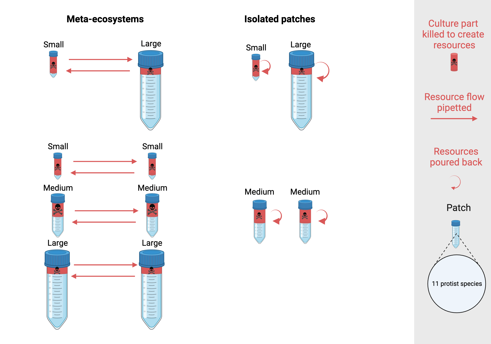

---
html_document:
  toc: yes
  toc_float: yes
  code_folding: hide
  number_sections: yes
  includes:
    after_body: "tabset-dropdown.html"
author: "Emanuele Giacomuzzo"
date: "`r format(Sys.time(), '%Y-%m-%d %H:%M')`"
output:
  html_document:
    code_folding: hide
    profiling: yes
bibliography: library.bib
title: "PhD Chapter 1 - PatchSize"
editor_options:
  chunk_output_type: console
---

```{r echo=FALSE, results=FALSE}
disturbance_global_input = "low"
```

```{r echo=FALSE}
print(paste("!!", 
            disturbance_global_input, 
            "!!", 
            "(this document showcases only the analysis done for the",
            disturbance_global_input, 
            "disturbance)"))
```

```{r echo=FALSE, results=FALSE, message=FALSE}
knitr::opts_chunk$set(message = FALSE,
                      cache = FALSE,
                      autodep = FALSE)

start_time = Sys.time()
library("here")
recompute_lengthy_analyses = FALSE
```

```{r child = here("r_files", "packages.Rmd"), echo=FALSE}
```

```{r echo=FALSE, message=FALSE, results=FALSE}
#Import functions
functions_paths = list.files(here("r_files", "functions"), 
                             pattern = ".R$", 
                             full.names = TRUE)
lapply(functions_paths, 
       source)
```

```{r child = here("r_files", "parameters.Rmd"), echo=FALSE}
```

#  {.tabset}

## Overview {.tabset .tabset-pills}



## Data {.tabset .tabset-dropdown}

### Experimental cultures (`culture_info`)

This table contains information about the 110 cultures of the experiment.

```{r experimental-cultures}
#Import culture info dataset
culture_info = read.csv(here("data", "PatchSizePilot_culture_info.csv"), header = TRUE)
```

### Individuals (ds_individuals)

```{r child = here("r_files", "ds_individuals.Rmd")}
```

### Patches (`ds_patches`)

```{r child = here("r_files", "ds_patches.Rmd")}
```

### Patch effect sizes (`ds_patches_effect_size`)

```{r}
save.image(file = here("environments", "before_ds_patches_effect_size.RData"))
```

```{r child = here("r_files", "ds_patches_effect_size.Rmd")}
```

### Meta-ecosystems (`ds_metaecosystems`)

```{r child = here("r_files", "combinations_patches.Rmd")}
```

```{r child = here("r_files", "combination_sets_patches.Rmd")}
```

```{r}
save.image(file = here("environments", "before_ds_metaecosystems.RData"))
```

```{r child = here("r_files", "ds_metaecosystems.Rmd")}
```

### Size classes (`ds_classes`)

```{r child = here("r_files", "ds_classes.Rmd")}
```

### Size classes effect size (`ds_classes_effect_size`)

```{r child = here("r_files", "ds_classes_effect_size.Rmd")}
```

```{r}
#Import datasets
files <- list.files(path = here("results", "ds"))
for (i in 1:length(files)) {
  load(here("results", "ds", files[i]))
}
```

```{r echo=FALSE, message=FALSE}
#Save environment
save.image(file = here("environments", "environment_first_part.RData"))
```

```{r}
#Load environment
load(here("environments", "environment_first_part.RData"))
```

### Filter according to disturbance

Here I'm filtering patches to have only the ones with disturbance `r disturbance_global_input`.

```{r}
#Filter data sets according to the global disturbance
ds_individuals = ds_individuals %>%
  filter(disturbance == disturbance_global_input)
ds_patches = ds_patches %>%
  filter(disturbance == disturbance_global_input)
ds_patches_effect_size = ds_patches_effect_size %>%
  filter(disturbance == disturbance_global_input)
ds_metaecosystems = ds_metaecosystems %>%
  filter(disturbance == disturbance_global_input)
ds_classes = ds_classes %>%
  filter(disturbance == disturbance_global_input)
ds_classes_effect_size = ds_classes_effect_size %>%
  filter(disturbance == disturbance_global_input)
```

## Plots & Analysis {.tabset .tabset-dropdown}

### All Meta-ecosystems {.tabset .tabset-pills}

```{r}
metaecosystem_type_input = c("Small-Small meta-ecosystem",
                             "Medium-Medium meta-ecosystem",
                             "Medium-Medium isolated",
                             "Large-Large meta-ecosystem",
                             "Small-Large meta-ecosystem",
                             "Small-Large isolated")
```

#### Biomass {.tabset .tabset-pills}

```{r child = here("r_files", "all_metaecos_biomass.Rmd")}
```

#### Shannon (mean) {.tabset .tabset-pills}

```{r child = here("r_files", "all_metaecos_shannon_mean.Rmd")}
```

#### Beta Diversity {.tabset .tabset-pills}

```{r child = here("r_files", "all_metaecos_beta_diversity.Rmd")}
```

#### Gamma Diversity {.tabset .tabset-pills}

```{r child = here("r_files", "all_metaecos_gamma_diversity.Rmd")}
```

#### BEF

```{r child = here("r_files", "all_metaecos_BEF.Rmd")}
```

### Medium-Medium vs Small-Large (connected and isolated) {.tabset .tabset-pills}

```{r}
metaecosystem_type_input = c(
  "Medium-Medium meta-ecosystem",
  "Medium-Medium isolated",
  "Small-Large meta-ecosystem",
  "Small-Large isolated"
)
```

#### Biomass {.tabset .tabset-pills}

```{r child = here("r_files", "MM_vs_SL_biomass.Rmd")}
```

#### Richness (mean) {.tabset .tabset-pills}

```{r child = here("r_files", "MM_vs_SL_richness_mean.Rmd")}
```

#### Shannon (mean) {.tabset .tabset-pills}

```{r child = here("r_files", "MM_vs_SL_shannon_mean.Rmd")}
```

#### Beta Diversity {.tabset .tabset-pills}

```{r child = here("r_files", "MM_vs_SL_beta_diversity.Rmd")}
```

#### Nestedness {.tabset .tabset-pills}

```{r child = here("r_files", "MM_vs_SL_nestedness.Rmd")}
```

#### Gamma Diversity {.tabset .tabset-pills}

```{r child = here("r_files", "MM_vs_SL_gamma_diversity.Rmd")}
```

### All patches {.tabset .tabset-pills}

```{r}
patch_type_input = c("Small isolated",
                     "Medium isolated",
                     "Large isolated",
                     "Small connected to small",
                     "Small connected to large",
                     "Medium connected to medium",
                     "Large connected to small",
                     "Large connected to large")
```


#### BEF {.tabset .tabset-pills}

```{r}
save.image(file = here("environments", "before_all_patches_BEF.RData"))
```

```{r child = here("r_files", "all_patches_BEF.Rmd")}
```

```{r child = here("r_files", "all_patches_species_correlations.Rmd")}
```

### Isolated patches {.tabset .tabset-pills}

```{r}
patch_type_input = c("Small isolated",
                     "Medium isolated",
                     "Large isolated")
```

#### Biomass {.tabset .tabset-pills}

```{r child = here("r_files", "isolated_patches_biomass.Rmd")}
```

#### Shannon {.tabset .tabset-pills}

```{r child = here("r_files", "isolated_patches_shannon.Rmd")}
```

#### Richness {.tabset .tabset-pills}

```{r child = here("r_files", "isolated_patches_richness.Rmd")}
```

#### Evenness {.tabset .tabset-pills}

```{r child = here("r_files", "isolated_patches_evenness.Rmd")}
```

#### Species Composition {.tabset .tabset-pills}

```{r child = here("r_files", "isolated_patches_species_composition.Rmd")}
```

#### Pop Density {.tabset .tabset-pills}

```{r child = here("r_files", "isolated_patches_pop_density.Rmd")}
```

#### Pop Dominance {.tabset .tabset-pills}

```{r child = here("r_files", "isolated_patches_pop_dominance.Rmd")}
```

#### Size Distribution {.tabset .tabset-pills}

```{r child = here("r_files", "isolated_patches_size_distribution.Rmd"), eval=FALSE}
```

#### Class Density {.tabset .tabset-pills}

```{r child = here("r_files", "isolated_patches_class_density.Rmd")}
```

#### Median Size {.tabset .tabset-pills}

```{r child = here("r_files", "isolated_patches_median_size.Rmd")}
```

### Small patches {.tabset .tabset-pills}

```{r}
patch_type_input = c("Small isolated",
                     "Small connected to small",
                     "Small connected to large")
```

#### Biomass {.tabset .tabset-pills}

```{r child = here("r_files", "small_patches_biomass.Rmd")}
```

#### Shannon {.tabset .tabset-pills}

```{r child = here("r_files", "small_patches_shannon.Rmd")}
```

#### Richness {.tabset .tabset-pills}

```{r child = here("r_files", "small_patches_richness.Rmd")}
```

#### Evenness {.tabset .tabset-pills}

```{r child = here("r_files", "small_patches_evenness.Rmd")}
```

#### Species Composition {.tabset .tabset-pills}

```{r child = here("r_files", "small_patches_species_composition.Rmd")}
```

#### Pop Density {.tabset .tabset-pills}

##### Ble {.tabset .tabset-pills}

```{r child = here("r_files", "small_patches_density_Ble.Rmd")}
```

##### Cep {.tabset .tabset-pills}

```{r child = here("r_files", "small_patches_density_Cep.Rmd")}
```

##### Col {.tabset .tabset-pills}

```{r child = here("r_files", "small_patches_density_Col.Rmd")}
```

##### Eug {.tabset .tabset-pills}

```{r child = here("r_files", "small_patches_density_Eug.Rmd"), eval = FALSE}
```

##### Eup {.tabset .tabset-pills}

```{r child = here("r_files", "small_patches_density_Eup.Rmd")}
```

##### Lox {.tabset .tabset-pills}

```{r child = here("r_files", "small_patches_density_Lox.Rmd")}
```

##### Pau {.tabset .tabset-pills}

```{r child = here("r_files", "small_patches_density_Pau.Rmd")}
```

##### Pca {.tabset .tabset-pills}

```{r child = here("r_files", "small_patches_density_Pca.Rmd")}
```

##### Spi {.tabset .tabset-pills}

```{r child = here("r_files", "small_patches_density_Spi.Rmd")}
```

##### Spi te {.tabset .tabset-pills}

```{r child = here("r_files", "small_patches_density_Spi_te.Rmd")}
```

##### Tet {.tabset .tabset-pills}

```{r child = here("r_files", "small_patches_density_Tet.Rmd"), eval = FALSE}
```

#### Pop Dominance {.tabset .tabset-pills}

##### Ble {.tabset .tabset-pills}

```{r child = here("r_files", "small_patches_dominance_Ble.Rmd")}
```

##### Cep {.tabset .tabset-pills}

```{r child = here("r_files", "small_patches_dominance_Cep.Rmd")}
```

##### Col {.tabset .tabset-pills}

```{r child = here("r_files", "small_patches_dominance_Col.Rmd")}
```

##### Eug {.tabset .tabset-pills}

```{r child = here("r_files", "small_patches_dominance_Eug.Rmd"), eval = FALSE}
```

##### Eup {.tabset .tabset-pills}

```{r child = here("r_files", "small_patches_dominance_Eup.Rmd")}
```

##### Lox {.tabset .tabset-pills}

```{r child = here("r_files", "small_patches_dominance_Lox.Rmd")}
```

##### Pau {.tabset .tabset-pills}

```{r child = here("r_files", "small_patches_dominance_Pau.Rmd")}
```

##### Pca {.tabset .tabset-pills}

```{r child = here("r_files", "small_patches_dominance_Pca.Rmd")}
```

##### Spi {.tabset .tabset-pills}

```{r child = here("r_files", "small_patches_dominance_Spi.Rmd")}
```

##### Spi te {.tabset .tabset-pills}

```{r child = here("r_files", "small_patches_dominance_Spi_te.Rmd")}
```

##### Tet {.tabset .tabset-pills}

```{r child = here("r_files", "small_patches_dominance_Tet.Rmd"), eval = FALSE}
```

#### Class Density {.tabset .tabset-pills}

```{r child = here("r_files", "small_patches_class_density.Rmd")}
```

#### Median Size {.tabset .tabset-pills}

```{r child = here("r_files", "small_patches_median_size.Rmd")}
```

#### Community change {.tabset .tabset-pills}

```{r child = here("r_files", "small_patches_divergence_from_isolated.Rmd")}
```

### Medium patches {.tabset .tabset-pills}

```{r}
patch_type_input = c("Medium isolated",
                     "Medium connected to medium")
```

#### Biomass {.tabset .tabset-pills}

```{r child = here("r_files", "medium_patches_biomass.Rmd")}
```

#### Shannon {.tabset .tabset-pills}

```{r child = here("r_files", "medium_patches_shannon.Rmd")}
```

### Large patches {.tabset .tabset-pills}

```{r}
patch_type_input = c("Large connected to large",
                     "Large connected to small",
                     "Large isolated")
```

#### Biomass {.tabset .tabset-pills}

```{r child = here("r_files", "large_patches_biomass.Rmd")}
```

#### Shannon {.tabset .tabset-pills}

```{r child = here("r_files", "large_patches_shannon.Rmd")}
```

#### Richness {.tabset .tabset-pills}

```{r child = here("r_files", "large_patches_richness.Rmd")}
```

#### Evenness {.tabset .tabset-pills}

```{r child = here("r_files", "large_patches_evenness.Rmd")}
```

#### Species Composition {.tabset .tabset-pills}

```{r child = here("r_files", "large_patches_species_composition.Rmd")}
```

#### Pop Density {.tabset .tabset-pills}

##### Ble {.tabset .tabset-pills}

```{r child = here("r_files", "large_patches_density_Ble.Rmd")}
```

##### Cep {.tabset .tabset-pills}

```{r child = here("r_files", "large_patches_density_Cep.Rmd")}
```

##### Col {.tabset .tabset-pills}

```{r child = here("r_files", "large_patches_density_Col.Rmd")}
```

##### Eug {.tabset .tabset-pills}

```{r child = here("r_files", "large_patches_density_Eug.Rmd"), eval = FALSE}
```

##### Eup {.tabset .tabset-pills}

```{r child = here("r_files", "large_patches_density_Eup.Rmd")}
```

##### Lox {.tabset .tabset-pills}

```{r child = here("r_files", "large_patches_density_Lox.Rmd")}
```

##### Pau {.tabset .tabset-pills}

```{r child = here("r_files", "large_patches_density_Pau.Rmd")}
```

##### Pca {.tabset .tabset-pills}

```{r child = here("r_files", "large_patches_density_Pca.Rmd")}
```

##### Spi {.tabset .tabset-pills}

```{r child = here("r_files", "large_patches_density_Spi.Rmd")}
```

##### Spi te {.tabset .tabset-pills}

```{r child = here("r_files", "large_patches_density_Spi_te.Rmd")}
```

##### Tet {.tabset .tabset-pills}

```{r child = here("r_files", "large_patches_density_Tet.Rmd"), eval = FALSE}
```

#### Pop Dominance {.tabset .tabset-pills}

##### Ble {.tabset .tabset-pills}

```{r child = here("r_files", "large_patches_dominance_Ble.Rmd")}
```

##### Cep {.tabset .tabset-pills}

```{r child = here("r_files", "large_patches_dominance_Cep.Rmd")}
```

##### Col {.tabset .tabset-pills}

```{r child = here("r_files", "large_patches_dominance_Col.Rmd")}
```

##### Eug {.tabset .tabset-pills}

```{r child = here("r_files", "large_patches_dominance_Eug.Rmd"), eval = FALSE}
```

##### Eup {.tabset .tabset-pills}

```{r child = here("r_files", "large_patches_dominance_Eup.Rmd")}
```

##### Lox {.tabset .tabset-pills}

```{r child = here("r_files", "large_patches_dominance_Lox.Rmd")}
```

##### Pau {.tabset .tabset-pills}

```{r child = here("r_files", "large_patches_dominance_Pau.Rmd")}
```

##### Pca {.tabset .tabset-pills}

```{r child = here("r_files", "large_patches_dominance_Pca.Rmd")}
```

##### Spi {.tabset .tabset-pills}

```{r child = here("r_files", "large_patches_dominance_Spi.Rmd")}
```

##### Spi te {.tabset .tabset-pills}

```{r child = here("r_files", "large_patches_dominance_Spi_te.Rmd")}
```

##### Tet {.tabset .tabset-pills}

```{r child = here("r_files", "large_patches_dominance_Tet.Rmd"), eval = FALSE}
```

#### Class Density {.tabset .tabset-pills}

```{r child = here("r_files", "large_patches_class_density.Rmd")}
```

#### Median Size {.tabset .tabset-pills}

```{r child = here("r_files", "large_patches_median_size.Rmd")}
```

#### Community change {.tabset .tabset-pills}

```{r child = here("r_files", "large_patches_divergence_from_isolated.Rmd")}
```

### Patches in Small-Large Meta-ecosystem {.tabset .tabset-pills}

```{r}
patch_type_input = c("Small connected to large",
                     "Small connected to small",
                     "Large connected to small",
                     "Large connected to large")
```

#### Biomass {.tabset .tabset-pills}

```{r child = here("r_files", "SL_patches_biomass.Rmd")}
```

#### Shannon {.tabset .tabset-pills}

```{r child = here("r_files", "SL_patches_shannon.Rmd")}
```

#### Richness {.tabset .tabset-pills}

```{r child = here("r_files", "SL_patches_richness.Rmd")}
```

#### Evenness {.tabset .tabset-pills}

```{r child = here("r_files", "SL_patches_evenness.Rmd")}
```

#### Pop Density {.tabset .tabset-pills}

```{r child = here("r_files", "SL_patches_pop_density.Rmd")}
```

#### Pop Dominance {.tabset .tabset-pills}

```{r child = here("r_files", "SL_patches_pop_dominance.Rmd")}
```

#### Class Density {.tabset .tabset-pills}

```{r child = here("r_files", "SL_patches_class_density.Rmd")}
```

#### Median Size {.tabset .tabset-pills}

```{r child = here("r_files", "SL_patches_median_size.Rmd")}
```

#### Temporal Divergence {.tabset .tabset-pills}

```{r child = here("r_files", "SL_patches_temporal_divergence.Rmd")}
```

## Tables

```{r child = here("r_files", "results_table_paper_version.Rmd")}
```

## Results {.tabset .tabset-pills}

### Isolated patches

```{r child = here("r_files", "results_isolated_patches.Rmd")}
```

### Two-patches

```{r child = here("r_files", "results_two_patches.Rmd")}
```

### Connected patches

```{r child = here("r_files", "results_connected_patches.Rmd")}
```

### Connected patches 2

```{r child = here("r_files", "results_connected_patches_2.Rmd")}
```

### Connected patches 3

```{r child = here("r_files", "results_connected_patches_3.Rmd")}
```

### Medium patches

```{r child = here("r_files", "results_medium_patches.Rmd")}
```

### Other

```{r child = here("r_files", "results_extra.Rmd")}
```

## Tests

```{r child = here("r_files", "model_evaporation.Rmd"), eval=FALSE}
```

```{r child = here("r_files", "test_evaporation.Rmd")}
```

## Analysis scripts {.tabset .tabset-pills}

### Video analysis

```{r child = here("r_files", "BEMOVI_script_video_analysis.Rmd"), class.source = "fold-show"}
```

### Species identification

```{r child = here("r_files", "BEMOVI_script_species_id.Rmd"), class.source = "fold-show"}
```

## Other

```{r child = here("r_files", "other.Rmd")}
```
