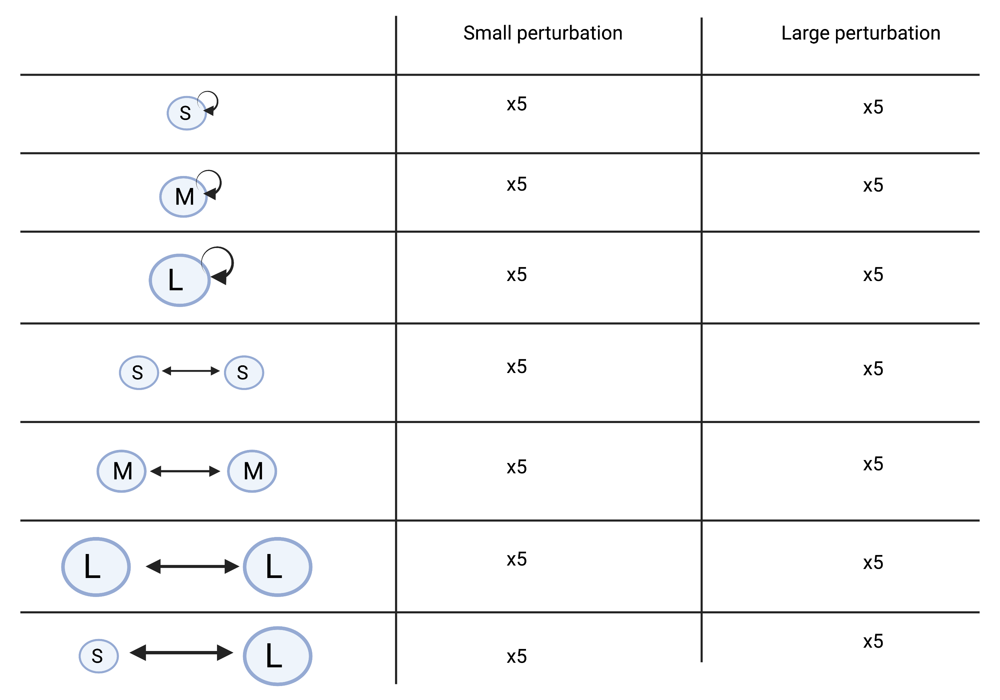

### Recap

Meta-ecosystems have been studied looking at meta-ecosystems in which patch size was the same. However, of course, we know that meta-ecosystems are mad out of patches that have different size. To see the effects of patch size on meta-ecosystem properties, we ran a four weeks protist experiment in which different ecosystems were connected through the flow of nutrients. The flow of nutrients resulted from a perturbation of the ecosystems in which a fixed part of the cultures was boiled and then poored into the receiving patch. This had a fixed volume (e.g., small perturbation = 6.75 ml) and was the same across all patch sizes. The experiment design consisted in crossing two disturbances with a small, medium, and large isolated ecosystems and with a small-small, medium-medium, large-large, and small-large meta-ecosystem. We took videos every four days and we create this perturbation and resource flow the day after taking videos. We skipped the perturbation the day after we assembled the experiment so that we would start perturbing it when population densities were already high.

We had mainly two research questions:

-   Do local properties of a patch depend upon the size of the patch it is connected to?

-   Do regional properties of a meta-ecosystem depend upon the relative size of its patch?

### Design

### Lab work

#### Creation of high-density monocultures

23/3/22 PPM for increasing the number of monocultures in the collection.

24/3/22 Collection control. See monoculture maintenance lab book p. 47.

26/3/22 Increase of number of monocultures in the collection. To do so, take the best culture and make 3 new ones. See monoculture maintenance lab book p. 47.

1/4/22 Make PPM for high density monocultures. See PatchSizePilot lab book p. 5.

3/4/22 Make bacterial solution for high density monocultures. See PatchSizePilot lab book p. 8.

5/4/22 Grow high density monocultures. Make 3 high density monocultures for each protist species with 200 ml with 5% bacterial solution, 85% PPM, 10% protists, and 2 seeds. See PatchSizePilot lab book p. 10

10/4/2022 Check high density monocultures. Cep, Eup, Spi, Spi te were really low.

13/4/2022 Start of the experiment. See PatchSizePilot p. 33.

#### Things I could have done better

\- Autoclave all the material in advance

\- Get more high-density monocultures

\- Decide in advance the days in which you are going to check the high-density monocultures and prepare bacteria in advance for that day so that if some of them crashed you are still on time to make new ones.

\- Use a single lab book for also when you create PPM and check the collection.

\- Make a really high amount of PPM, as you will need for so many different things (\>10 L). Maybe also autoclave 1 L Schott bottles so that you don't have to oxygenate whole 5 L bottles of PPM. I think that I should have maybe made even a 10 L bottle of PPM.

\- According to Silvana protists take 4-7 days to grow. The fastest is Tet (ca 4 days) and the slowest is Spi (ca 7 days). Once that you grow them they should stay at carrying capacity for a bit of time I guess, as you can see in the monoculture collection. I should make sure I'm growing them in the right way. I think that maybe I should grow them 10 days in advance so that I could actually grow also the slow species if they crashed. What should I do if all of them crashed?
