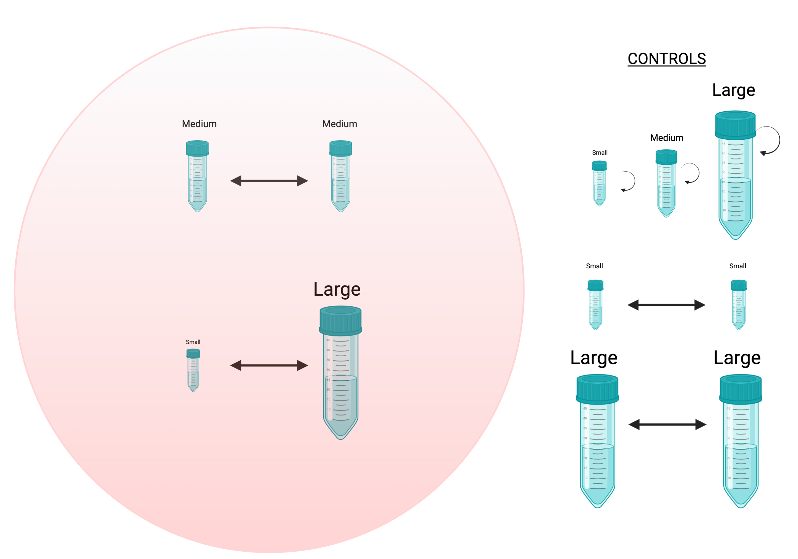

### Title page

Title: Scaling Up Ecosystem Function with Meta-ecosystem Theory: How Flows of Non-living Material between Patches of Different Size can Homogenise their Productivity

Authors (add affiliations): Emanuele Giacomuzzo, Tianna Peller, Isabelle Gounand, Florian Altermatt

Number of words: ... Number of figures: ...

### Abstract

Keywords: ...

### Introduction

Studying ecosystem function is crucial in understanding the impact that humans have on ecosystems. Ecosystem function refers to the processes that take place within an ecosystem, such as nutrient cycling, energy flow, and species interactions. These processes are essential for the maintenance of ecosystem services, which are the benefits that humans derive from ecosystems, such as clean air and water, food, and medicine. By studying ecosystem function, scientists can identify how human activities, such as land use changes, pollution, and climate change, are affecting these processes and ultimately, the provision of ecosystem services. This knowledge can then be used to improve ecosystem management strategies and policies to reduce negative impacts and promote sustainability, allowing us to continue to benefit from ecosystem services for years to come.

In recent years, there has been a growing recognition of the importance of the flow of non-living material, such as detritus and inorganic nutrients between ecosystems and how it can influence the function of a landscape. We now know that the exchange of non-living material between ecosystems can have a significant impact on ecosystem processes, such as primary production, decomposition, and nutrient cycling. For example, the reciprocal flow of limiting nutrients has been experimentally found to increase patch function when heterogeneity would otherwise partition different nutrients into different patches, making them being used less efficiently (@Gulzow2019). Also, how connection between patches are configured, how many patches each patch is connected to, and the number of connections of the most connected patch have been found to influence patch function (@Marleau2014). Understanding the flow of non-living material between ecosystems is essential for predicting and managing the impacts of human activities, such as land use changes and climate change, on ecosystem function and the provision of ecosystem services. Ecosystems that are connected through the flow of non-living material are referred to as meta-ecosystems (@Loreau2003).

Previous models and experiments in ecosystem function have generally assumed that all patches are the same size. However, the size of both the receiving and donor patches has the potential to significantly alter meta-ecosystem dynamics, as it can impact both the production and reception of subsidies.

In this study, we aimed to investigate how patch size affects meta-ecosystem function using a protist microcosm experiment (@Altermatt2015). We compared meta-ecosystems with symmetric and asymmetric patch sizes to understand how non-living material flows between patches of different sizes. The flow of non-living material was created with an absolute volume, and we predicted that larger patches would be more productive as they would be less perturbed than smaller patches. Therefore, more resources would flow from large patches than from small patches. We also hypothesized that the medium-medium meta-ecosystem would be more productive, as we predicted a concave relationship between patch size and function. Additionally, we expected that the larger the donor ecosystem, the more beneficial it would be for the receiving patch, as it needs detritus to recover from perturbations. Finally, we discuss the broader implications of our findings for the field of ecosystem function and meta-ecosystem theory.

### Methods

#### Experimental design

The effects of patch size on local and regional meta-ecosystem properties was examined through a protist microcosm experiment (@Altermatt2015). Each meta-ecosystem consisted of two cultures that were exposed to a disturbance regime. During each disturbance event, a portion of the community was transformed into detritus, which flowed bidirectionally between cultures, connecting them through resource flow. Within a meta-ecosystem, only non-living material was exchanged, and no organisms dispersed. [polished]

Our focal meta-ecosystem was made up of a small patch (7.5 ml) and a large patch (37.5 ml). To investigate the effect of such a size difference on regional properties, we compared this meta-ecosystem to another meta-ecosystem of the same total volume (45 ml) that contained two medium-sized patches (22.5 ml) instead of a small and large patch. To analyze local patch properties, we compared the small patch to other small patches that were either connected to another small patch or isolated instead of being connected to a large patch. Additionally, we evaluated the effect of patch size by comparing isolated patches of different sizes (small, medium, and large) and meta-ecosystems with patches of different sizes (meta-ecosystems with small, medium, and large patches). We referred to the meta-ecosystems based on the size of their patches (e.g., meta-ecosystems with a small and a large patch were called small-large meta-ecosystems). [polished]

All meta-ecosystems and isolated patch treatments were exposed to either low or high disturbance intensities. This resulted in a full factorial design in which we varied (1) the size of meta-ecosystems and isolated patches and (2) disturbance intensity. Each treatment was replicated five times, resulting in a total of 110 microcosms (30 isolated patches and 80 meta-ecosystem patches). Please see Figure 1 for more details. [polished]

#### Experimental setup

In preparation for the experiment, we cultured protist densities to their carrying capacity eight days before assembly. This was accomplished by using autoclaved bottles with medium, two wheat seeds, and a bacterial mix comprising *Serratia fonticola*, *Bacillus subtilis*, and *Brevibacillus brevis* (see @Altermatt2015 for protocols). The standard protist medium (0.46 g/L of Protozoa Pellet by Carolina) was used for the medium, and the bacterial mix constituted 5% of the total culture volume. On the day of the experiment's assembly, we inoculated a large, autoclaved bottle with the eleven protist species, with the same volume being inoculated for each species. The final total volume of the large bottle was 15%, and this was pipetted into sterile 50 ml centrifuge tubes (SPL life sciences skirted conical centrifuge tubes). We pipetted 7.5 ml, 22.5 ml, and 37.5 ml into the small, medium, and large patches, respectively. The cultures were then randomized on four foam boards and kept in an incubator at 20°C with constant lighting. The community of protists we refer to here consists of nine water ciliates (*Euplotes aediculatus*, *Colpidium sp.*, *Loxocephalus sp.*, *Paramecium aurelia*, *Paramecium caudatum*, *Spirostomum sp.*, *Spirostomum teres*, *Tetrahymena cf. pyriformis*, and *Blepharisma sp.*), one alga (*Euglena gracilis*), and one rotifer (*Cephalodella sp.*). [polished]

#### Resource flow

The experiment involved six disturbance events occurring every four days, starting from day 5 (on days 5, 9, 13, 17, 21, and 25). During a disturbance event, subsamples of the cultures (5.25 ml for low disturbance and 6.75 ml for high disturbance) were boiled using a microwave, transforming the community into detritus. These subsamples corresponded to 70% and 90% of the volume of the small patches for low and high disturbance, respectively. In isolated patches, the boiled subsample was poured back into the original patch, whereas in meta-ecosystems, it was poured into the connected patch. This resource flow method imitated the detritus flow resulting from the death of organisms from patch recurrent disturbance. As the volume exchanged between patches remained the same (e.g., 5.25 ml flowed from patch 1 to 2 and 5.25 ml from patch 2 to 1), the patch volume remained constant over time. [polished]

#### Sampling

Throughout the experiment, we monitored changes in community dynamics over time. Sampling occurred eight times, every four days (on days 0, 4, 8, 12, 16, 20, 24, and 28). At each sampling, we collected 0.2 ml samples per microcosm. We followed a standardized video procedure (@Pennekamp2013; @Pennekamp2015) by recording a five-second video for each sample. The sample was placed under a dissecting microscope connected to a camera, which recorded the culture for five seconds. Using the R-package BEMOVI (@Pennekamp2015), we extracted the number of moving organisms, along with their traits (e.g., speed, shape, size), from the images using image processing software (ImageJ). These traits were then utilized to filter out background movement noise (e.g., medium particles) and to identify species in mixed cultures. [polished] [Add species ID]

#### Volume Balance

Throughout the experiment, we observed and accounted for variations in evaporation from microwaving across microcosms. For the initial three exchange events, we boiled 15 tubes in a rack at 800 W for three minutes using a microwave (Sharp R-202). However, due to high evaporation volumes of 2.43 ml (SD = 0.87), we boiled four tubes for one minute for the last three exchanges. This change in boiling protocol resulted in a mean evaporation rate of 1.25 ml (SD = 0.37). [polished]

The evaporated water was replenished with autoclaved deionized water. Before the two exchange events, 1 ml of water was added to all tubes. However, before the third exchange event, we observed higher than anticipated evaporation rates, and the cultures were on average 1.17 ml (SD = 0.37) smaller than their initial volumes. Therefore, before the third exchange and after each subsequent exchange, we refilled the cultures with water until they reached their initial volume. During the first exchange event, we microwaved most tubes with other full tubes, except for the last five tubes, which were microwaved with ten empty tubes. Replacing full tubes with empty ones resulted in a higher evaporation rate. These tubes were all part of the high disturbance small-large meta-ecosystem treatment. To compensate, we added 3.15 ml of water just before the second resource exchange (as we calculated that this was the evaporated volume difference). We microwaved all tubes with other full tubes during subsequent exchange events. [polished]

Additionally, we added medium to the cultures during each exchange event to account for the volume sampled at each time point (0.2 ml). However, medium was not added during the sixth exchange as it was right before the final time point. Sampling 0.2 ml of culture at the last time point would not have affected the results as it was the last day of the experiment. [polished]

#### Biodiversity computation

Evenness was calculated with the Pielou index, as Shannon / log Species richness.

#### Statistical analysis

##### Mixed effect models

To perform mixed effect modeling on our data, we utilized the R package lme4. The code syntax was obtained from the vignette available at <https://cran.r-project.org/web/packages/lme4/vignettes/lmer.pdf>. Interaction terms were coded following the guidelines provided in chapter 9 of the book "An R Companion to Statistics: Data Analysis and Modeling" by Maarten Speekenbrink (<https://mspeekenbrink.github.io/sdam-r-companion/linear-mixed-effects-models.html>). Model diagnostics were conducted using quantile-quantile plots (plot(mixed_model)) and partial residual plots (qqnorm(resid(mixed_model))), as recommended by @Zuur2009 (page 487).

The effect size of the explanatory variables was computed as marginal and conditional R squared. The marginal R squared represents the amount of variance explained by the fixed effects, while the conditional R squared accounts for both the fixed and random effects. The calculation of marginal and conditional R squared was performed using the MuMIn package, based on the methods of @Nakagawa2017. For the coding and interpretation of these R squared values, refer to the documentation for the r.squaredGLMM function.

Time can either be included as a fixed or random effect. If the data points are dependent on each other (e.g. seasons), time should be included as a random effect. However, since the biomass in our experiment showed a temporal trend and exhibited autocorrelation (i.e. t2 is more similar to t3 than t4), we decided to include time as a fixed effect. For a comprehensive discussion on this topic, see this blog post: <https://dynamicecology.wordpress.com/2015/11/04/is-it-a-fixed-or-random-effect/>.

Some interactions cannot be tested in R, as described in this Stack Overflow thread (<https://stackoverflow.com/questions/40729701/how-to-use-formula-in-r-to-exclude-main-effect-but-retain-interaction>). This is specifically the case when the interaction is between a factor (e.g., patch_type) and a continuous variable (e.g. day), and the factor is the primary predictor. This limitation is due to the model.matrix.default function. To test the effects of day, I must remove the interaction term with patch_type.

##### Effect sizes

To determine how response variables change across treatments, we chose to use an effect size with the control being a patch of the same size but isolated. Initially, we considered using the natural logarithm of the response ratio (lnRR), but some values of the response variables in the control or treatment were 0. Adding 1 to all null values, as suggested in the literature, would have inflated the effect sizes. As a result, we searched for alternative effect size metrics and found that Hedge's d (also known as Hedge's g) is the most commonly used and preferred metric today (@Hedges1985). Hedge's d is calculated as the difference in mean between the treatment and control groups divided by the standard deviation of the pooled data. Another option would have been Cohen's d, but this metric is less effective for sample sizes smaller than 20 (as discussed in this post on StatisticsHowTo: <https://www.statisticshowto.com/hedges-g/>).

##### Model selection

Model selection was performed using the Akaike Information Criterion (AIC). A difference in AIC of 2 was considered to be the threshold that distinguishes between two models, with the model having the lower AIC being preferred. If the difference in AIC does not exceed 2, the model with the smallest number of parameters is preferred. This approach was suggested by @Halsey2019 as an alternative to using p-values. P-values are not a reliable method of model selection due to the small sample size (five replicates), which can result in larger p-values, and because p-values can be highly variable, leading to many false positives and negatives (e.g., with a p-value of 0.05, there is a 1 in 3 chance that it's a false positive).

##### Size distribution

The selection of the number of size classes was arbitrary and based on the same number used by @Jacquet2020. Currently, there is no established standard for optimizing the number of size classes when analyzing body size distributions in ecology (@Loder1997).

##### Confidence intervals

To determine the 95% confidence interval of means, I used a code that can be found on a Stack Overflow thread (<https://stackoverflow.com/questions/35953394/calculating-length-of-95-ci-using-dplyr>). The code is based on the formula presented in the Lumen Learning course "Introduction to Statistics" (<https://courses.lumenlearning.com/introstats1/chapter/a-single-population-mean-using-the-student-t-distribution/>). The formula to calculate the upper and lower bounds of the 95% confidence interval is as follows:

$$
CI_{lower} = mean - (t \: score * \frac{SD}{sample \: size})
$$

$$
CI_{upper} = mean + (t \: score * \frac{SD}{sample \: size})
$$

where the t-score is computed from the student t distribution using the r function qt with percentile = 0.975 and degrees of freedom = sample size - 1.

To determine the 95% confidence interval of Hedge's d, I used a formula that is part of DATAPLOT, a software system for scientific visualization, statistical analysis, and non-linear modeling provided by the US government (as described in the following link: <https://www.itl.nist.gov/div898/software/dataplot/refman1/auxillar/hedges_g.htm>). The method was also suggested in a Cross Validated thread ([https://stats.stackexchange.com/questions/460367/calculate-effect-size-and-confidence-interval-from-published-means±std](https://stats.stackexchange.com/questions/460367/calculate-effect-size-and-confidence-interval-from-published-means±std){.uri}). I also cited <https://www.meta-analysis.com/downloads/Meta-analysis%20Effect%20sizes%20based%20on%20means.pdf>, but I am unsure why.

Hedge's d ± 95% confidence interval is computed as Hedge's d ± 1.96 \* SE, where SE is calculated as follows:

$$
SE_g = \sqrt{V_g}
$$

$$
V_g = J^2 * V_d
$$

$$
J = 1 - \frac{3}{4df-1}
$$

$$
V_d = \frac{n1 + n2}{n_1 n_2} + \frac{d^2}{2(n_1 + n_2)}
$$

where d is Hedge's d, n1 is the sample size of group 1, n2 is the sample size of group 2, and df is the degrees of freedom (df = n1 + n2 - 2).

### Results

### Discussion

Previous models and experiments in ecosystem function have generally assumed that all patches are the same size. However, the size of both the receiving and donor patches has the potential to significantly alter meta-ecosystem dynamics, as it can impact both the production and reception of subsidies. We would expect more subsidies coming out of larger donor patches because of two main reasons. The first is larger ecosystems have a higher area:perimeter ratio, which means that from the same length of the ecotone we would have more area associated to it. For example, the larger lakes and rivers, the more emerging insects come out per metre of their ecotone (@Gratton2009). The second reason for more subsidies coming out of larger ecosystems is that if the the subsidies are a fixed fraction of the total production, larger ecosystems might be more productive because of higher biodiversity (@Benedetti-Cecchi2005) and therefore give away more subsidies. We also would expect that the subsidies coming out of larger patches would be more full in nitrogen and phosphorus compared to carbon, as larger patches often have longer food chains (@Post2000) and nitrogen and phosphorus ratios increase along trophic levels. Furthermore, we would expect that the size of the receiving patch would be important for different reasons. First, if smaller patches would be really less productive, the same amount of non-living material flowing in would have a stronger effect on the recipient ecosystem (ref). Second, more non-living material would be flowing in, as they have a higher ratio between perimeter and area. Studies supporting this show that non-living material increases the secondary production the most in small islands (@Polis1996) and salmon subsidies provide nitrogen the most in small river watersheds (@Hocking2009).

The meta-ecosystem theory's theoretical framework has not considered the significance of patch size, despite its established impact on various ecological levels, including genotypes, populations, and communities. To comprehend how patch function can be scaled up to account for resource flows, integrating patch size into the meta-ecosystem framework is crucial. Our study suggests that patch size symmetry in a meta-ecosystem may not be critical to its operation. The explanation lies in the quantity of detritus exchanged between patches. Detritus is essential for patches to recover from perturbations. In the absence of resource flows, asymmetric size would lead to a more productive meta-ecosystem since the production of large and small isolated patches together was greater than that of two medium-sized patches. However, the reciprocal flow of resources between asymmetric-sized patches can reduce the function of the meta-ecosystem. This is due to the non-symmetric effects of the reciprocal flow of resources on small and large patches. The influx of resources from a large patch enhances the function of a small patch less than the small amount of resources from small patches increases the function of large patches. Consequently, the overall function of the meta-ecosystem decreases.

Our experiment demonstrated that asymmetric patch size has diverse impacts on biodiversity, with alpha diversity decreasing while beta diversity increases, and gamma diversity remains constant. Notably, small patches exhibited low alpha diversity, which contributed to the reduction in mean alpha diversity of the entire meta-ecosystem. However, alpha diversity increased due to resource flow, as the high influx of detritus improved their alpha diversity. As anticipated, the higher beta diversity in asymmetric patches resulted from the difference in alpha diversity between small and large patches. The absence of any change in gamma diversity was not unexpected and necessitates further explanation from Florian.

Patch size has an effect on meta-ecosystem function. However, this will depend upon the amount of resource flow happening between the two patches. When there isn't any flow between the two patches, small-large meta-ecosystems are the most productive (opposed to what @Benedetti-Cecchi2005 predicted). However, the more detritus is exchanged, the less the function of the meta-ecosystem, as it is mainly driven by the largest system. The small patch increases in function in

The higher species richness experienced by small patches is in line with the Subsidized Island Biogeography Hypothesis (@Anderson2001).

#### Acknowledgments

#### Figure captions

```{r}

figure_caption_1 = "Figure 1. Experimental Design. We constructed meta-ecosytems made out two patches."

figure_caption_2 = paste(
  "Figure 2. Effect of patch size on (a) isolated patch bioarea density and (b) isolated patch alpha diversity. (a): the larger the patch, the more biomass density it had (bioarea is a proxy for biomass). (b): the larger the patch was, the higher its diversity (Shannon Index) was. All patches were sampled at the same time but points were jettered to make the figure clearar. Vertical grey lines: disturbance events."
  )

figure_caption_3 = paste(
  "Figure 3. Effect of asymmetry in patch size and resource flow on (a) meta-ecosystem total bioarea and (b) meta-ecosystem beta diversity. (a): medium-medium and small-large meta-ecosystems had the same biomass (bioarea is a proxy for biomass). (b): small-large meta-ecosystems maintained higher beta diversity (Bray-Curtis Index). All systems were sampled at the same time but points were jettered to make the figure clearar. Vertical grey lines: disturbance events followed by resource flow."
)

figure_caption_4 = paste(
  "Figure 4. Effect of the resource flow on the patches of meta-ecosystems. The effects of resource flow have been measured as effect size (Hedge's d) compared to their respective isolated patches. Top: effects of resource flow on the biomass (bioarea is used as a proxy for biomass) of the small and the large patches. Flow from the small to the large increased the biomass of the small patch. Flow from the small patch decreased the biomass of the biomass of the large patch. Bottom: effects of resource flow on the alpha diversity (Shannon Index) of the small and the large patches. Flow from the large to the small increased the biodiveristy of the small patch. Flow from the small patch to the large patch had no effect on alpha diversity of the large patch. All patches were sampled at the same time but points were jettered to make the figure clearar. Vertical grey lines: disturbances events followed by resource flow. The effect of patch size and size of the connected patch on biomass was analyzed using two linear models, one for small patches and the other for large patches. We used the same type of models for analysing the shannon index."#,
  # "Biomass models:",
  # results_small_patches_biomass_patch_type_day,
  # results_large_patches_biomass_patch_type_day,
  # "Alpha diversity models: ",
  # results_small_patches_shannon_patch_type_day,
  # results_large_patches_shannon_patch_type_day
  )
```

#### Figures



```{r fig-isolated-patches, fig.cap = figure_caption_2}

ggarrange(
  p_isolated_biomass +
    rremove("xlab") +
    theme(axis.text.x = element_blank(),
          axis.ticks.x = element_blank(),
          plot.margin = unit(c(ggarrange_margin_top,
                               ggarrange_margin_right,
                               ggarrange_margin_bottom,
                               ggarrange_margin_left), 
                             "cm")) +
    font("legend.text", size = size_legend) +
    font("ylab", size = size_y_axis), 
  p_isolated_alpha +
    theme(plot.margin = unit(c(ggarrange_margin_left,
                               ggarrange_margin_right,
                               ggarrange_margin_bottom,
                               ggarrange_margin_left), 
                             "cm")) + 
    font("xlab", size = size_x_axis) + 
    font("ylab", size = size_y_axis) +
  scale_x_continuous(breaks = unique(ds_patches$day)),
  nrow = 2,
  heights = c(0.9,1),
  common.legend = TRUE,
  align = "v"
)
```

```{r fig-connected-systems, fig.cap = figure_caption_3, fig.height = 7}
ggarrange(
  p_MM_SL_metaecos_biomass +
    rremove("xlab") +
    theme(axis.text.x = element_blank(),
          axis.ticks.x = element_blank(),
          plot.margin = unit(c(ggarrange_margin_top,
                               ggarrange_margin_right,
                               ggarrange_margin_bottom,
                               ggarrange_margin_left), 
                             "cm")) +
    font("legend.text", size = size_legend) +
    font("ylab", size = size_y_axis),
  p_MM_SL_metaecos_alpha +
    rremove("xlab") +
    theme(axis.text.x = element_blank(),
          axis.ticks.x = element_blank(),
          plot.margin = unit(c(ggarrange_margin_top,
                               ggarrange_margin_right,
                               ggarrange_margin_bottom,
                               ggarrange_margin_left), 
                             "cm")) +
    font("legend.text", size = size_legend) +
    font("ylab", size = size_y_axis),
  p_MM_SL_metaecos_beta +
    theme(plot.margin = unit(c(ggarrange_margin_left,
                               ggarrange_margin_right,
                               ggarrange_margin_bottom,
                               ggarrange_margin_left), 
                             "cm")) + 
    font("xlab", size = size_x_axis) +
    font("ylab", size = size_y_axis) +
    scale_x_continuous(breaks = unique(ds_patches$day)),
  heights = c(0.8,0.8,1),
  nrow = 3,
  common.legend = TRUE,
  align = "v"
)

```

```{r fig-connected-patches, fig.cap = figure_caption_4}

ggarrange(
  p_connected_biomass_effect_size +
    rremove("xlab") +
    theme(axis.text.x = element_blank(),
          axis.ticks.x = element_blank(),
          plot.margin = unit(c(ggarrange_margin_top,
                               ggarrange_margin_right,
                               ggarrange_margin_bottom,
                               ggarrange_margin_left), 
                             "cm")) +
    font("legend.text", size = size_legend) +
    font("ylab", size = size_y_axis), 
  p_connected_alpha_effect_size +
    theme(plot.margin = unit(c(ggarrange_margin_left,
                               ggarrange_margin_right,
                               ggarrange_margin_bottom,
                               ggarrange_margin_left), 
                             "cm")) + 
    font("xlab", size = size_x_axis) + 
    font("ylab", size = size_y_axis) +
    scale_x_continuous(breaks = unique(ds_patches$day)),
  nrow = 2,
  heights = c(0.9,1),
  common.legend = TRUE,
  align = "v"
)
```

#### Appendix

```{r}
p_MM_SL_metaecos_gamma
```

**Discarded**

#### Bibliography
